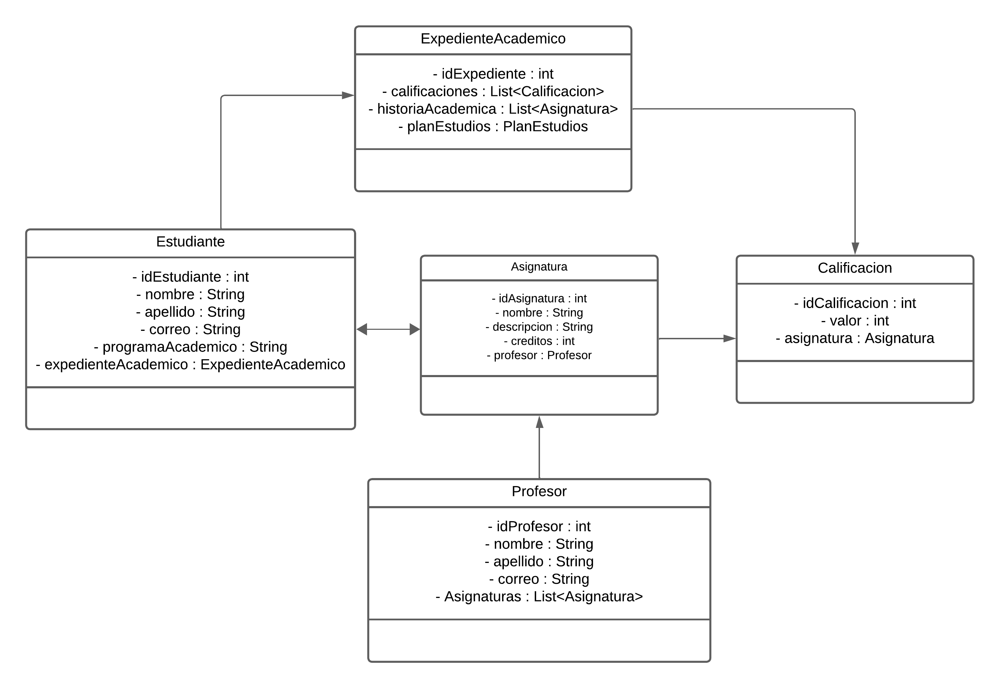

# Matriculación

- Se simula el proceso de matriculación de un estudiante en una universidad.
- Información personal del estudiante.
- Información de la carrera.
- Información de la asignatura.
- Información de calificaión.
- Informacion expediente académico.

